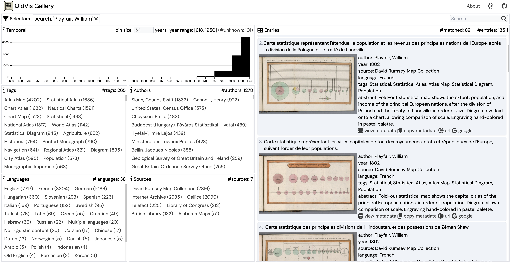

<a href="http://commitizen.github.io/cz-cli/">
    
</a>

# OldVis Gallery



A web-based gallery of old visualizations ([live demo](https://oldvis.github.io/gallery/)).

The gallery uses the dataset from [oldvis_dataset](https://github.com/oldvis/oldvis_dataset).

## Features

- Search with freeform text (e.g., `Playfair`) or attribute queries (e.g., `authors:(Playfair, William)`)
- Embed query parameters in the URL (e.g., [`?authors:(Neurath,+Otto)`](https://oldvis.github.io/gallery/?authors:(Neurath,+Otto)))

## Development Instructions

1. Clone this repository.
2. Run `pnpm install` to install dependencies (make sure you have [node.js](https://nodejs.org/) and [pnpm](https://pnpm.io/) installed before).
3. Run `pnpm run dev` to launch the dev server.

This repository is initialized with the [vitesse-lite template](https://github.com/antfu/vitesse-lite).

## Reference

If you use this gallery in a scientific publication, we would appreciate citations to the following paper:

```
@Article{Zhang2023OldVisOnline,
  author    = {Zhang, Yu and Jiang, Ruike and Xie, Liwenhan and Zhao, Yuheng and Liu, Can and Ding, Tianhong and Chen, Siming and Yuan, Xiaoru},
  title     = {{OldVisOnline}: Curating a Dataset of Historical Visualizations},
  doi       = {10.1109/TVCG.2023.3326908},
  volume    = {30},
  number    = {1},
  pages     = {551--561},
  journal   = {IEEE Transactions on Visualization and Computer Graphics},
  publisher = {IEEE},
  year      = {2023},
}
```
