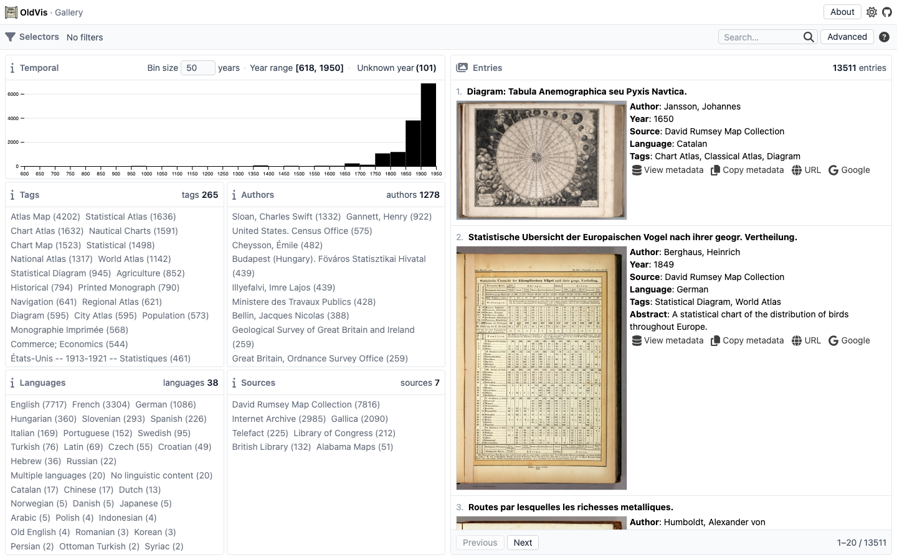

<p align="center">
  <a href="https://pnpm.io/"></a>
  <a href="https://vuejs.org/"></a>
  <a href="./LICENSE"></a>
</p>

# OldVis Gallery

A web gallery of historical visualizations. Browse the [oldvis_dataset](https://github.com/oldvis/oldvis_dataset) catalog, filter by metadata and time, and search by text or image description. Everything runs in the browser — no server database needed.

[Live demo](https://oldvis.github.io/gallery/)

## Features

- **Browse**: paginated entries with metadata, thumbnails, and source links
- **Facets & time**: filter by authors, tags, languages, sources, and publish-year histogram bins
- **Search**: freeform metadata search, field queries (`authors:(Playfair, William)`), and CLIP image search (`image:(bar chart)`)
- **Advanced filters**: build Field / Keyword / Image / Year criteria in a dialog without hand-writing syntax
- **Shareable URLs**: selectors sync to the query string so filtered views can be linked

## See It In Action

Selectors, temporal chart, facets, and entries sit in one screen.



## Start Using It

### Try the live demo

Open the hosted app:

[https://oldvis.github.io/gallery/](https://oldvis.github.io/gallery/)

### Run locally

```bash
pnpm install
pnpm dev
```

## Search Features

To find visualizations, use any of these controls in the UI:

- **Search…** — type keywords, or paste a field / image query
- **Advanced** — add field, keyword, image, or year filters as form rows (no syntax required)
- **Facets & year histogram** — click an author, tag, language, source, or year bin

Active filters appear as chips under Selectors and are embedded in the page URL for sharing (e.g. [`https://oldvis.github.io/gallery/?authors:(Neurath,+Otto)`](https://oldvis.github.io/gallery/?authors:(Neurath,+Otto))).

Useful query examples (type them in **Search…**, or open the link):

| Kind | Example | Result |
| --- | --- | --- |
| Keywords | [`Playfair`](https://oldvis.github.io/gallery/?search=Playfair) | Matches titles, abstracts, authors, tags, and related metadata |
| Exact field | [`authors:(Playfair, William)`](https://oldvis.github.io/gallery/?authors:(Playfair,+William)) | Keeps entries whose `authors` field is exactly that value |
| Image description | [`image:(bar chart)`](https://oldvis.github.io/gallery/?image:(bar+chart)) | CLIP semantic search over the pictures (`\|topk:<N>` optional) |

Combine several filters with `&`, or add multiple rows in **Advanced** and Apply. Full syntax and supported fields: [docs/SEARCH_FEATURES.md](./docs/SEARCH_FEATURES.md).

## For Developers

| Command                | Description                                         |
| ---------------------- | --------------------------------------------------- |
| `pnpm install`         | Install dependencies                                |
| `pnpm dev`             | Start the local app (`http://localhost:3333`)       |
| `pnpm build`           | Build for production (GitHub Pages `base`)          |
| `pnpm lint`            | Run ESLint                                          |
| `pnpm typecheck`       | Check TypeScript types                              |
| `pnpm test`            | Run unit tests (watch)                              |
| `pnpm test:unit`       | Run unit tests once                                 |
| `pnpm test:e2e`        | Run end-to-end tests                                |
| `pnpm docs:screenshot` | Update `docs/images/screenshot.png` for this README |

You will need:

- [Node.js](https://nodejs.org)
- [pnpm](https://pnpm.io/)
- Playwright browsers for e2e / screenshots (`pnpm exec playwright install` if needed)

Dataset JSON lives under `src/assets/` (for example `visualizations.json`). Shared UI language is documented in [DESIGN.md](./DESIGN.md).

See [CONTRIBUTING.md](./CONTRIBUTING.md) for contribution notes.

This project started from the [vitesse-lite](https://github.com/antfu-collective/vitesse-lite) template.

## Reference

If you use this gallery in a scientific publication, please cite:

```
@Article{Zhang2023OldVisOnline,
  author    = {Zhang, Yu and Jiang, Ruike and Xie, Liwenhan and Zhao, Yuheng and Liu, Can and Ding, Tianhong and Chen, Siming and Yuan, Xiaoru},
  title     = {{OldVisOnline}: Curating a Dataset of Historical Visualizations},
  doi       = {10.1109/TVCG.2023.3326908},
  volume    = {30},
  number    = {1},
  pages     = {551--561},
  journal   = {IEEE Transactions on Visualization and Computer Graphics},
  publisher = {IEEE},
  year      = {2023},
}
```
